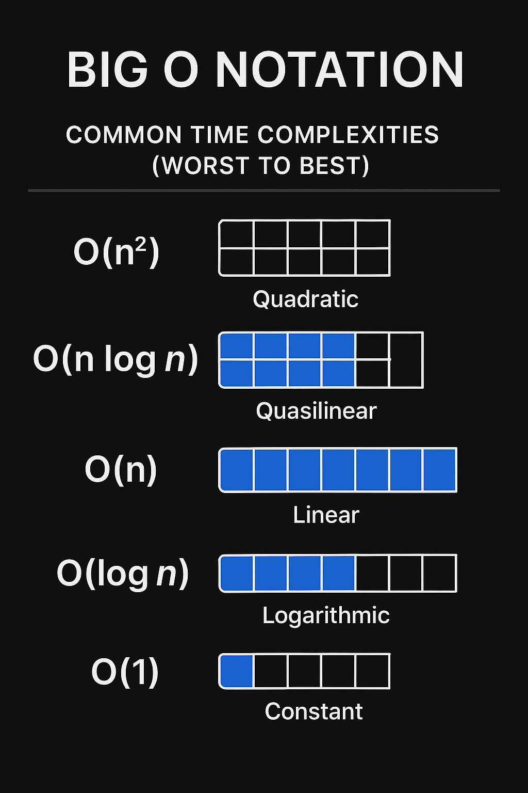

# 💡 Big O Notation – Introduction to Complexity Analysis

> **Big O Notation** describes the **scalability** of algorithms, not necessarily their real-world performance.

It measures how **time (runtime)** or **space (memory)** requirements grow as the input size increases.

We typically evaluate the **worst-case** scenario unless stated otherwise.

---

## 📌 When do we use Big O?

- To **compare algorithms** independently of hardware
- In coding interviews and technical evaluations
- When choosing the right data structure or algorithm

---

## 🧠 Types of Complexity

### 1. Time Complexity
The number of operations grows with input size `n`.

### 2. Space Complexity
The amount of **extra memory** required grows with input size.

---

## 📊 Common Big O Notations (Worst to Best)

| Notation      | Name         | Example Algorithms                                                       | Description                        |
|---------------|--------------|---------------------------------------------------------------------------|------------------------------------|
| `O(n²)`       | Quadratic    | [Bubble Sort](../sorting/bubbleSort), [Selection Sort](../sorting/selectionSort) | Nested loops over data             |
| `O(n log n)`  | Quasilinear  | [Merge Sort](../sorting/mergeSort), [Quick Sort](../sorting/quickSort)         | Divide and conquer pattern         |
| `O(n)`        | Linear       | [Linear Search](../search/linearSearch)                                        | Single pass through data           |
| `O(log n)`    | Logarithmic  | [Binary Search](../sorting/binarySearch/)                                      | Repeated halving                   |
| `O(1)`        | Constant     | [Array Index Access](../fundamentals/arrayAccess)                            | Same time regardless of input size |

---

## 🧪 Practical Examples

- **O(1)** → `arr[5]` (direct index access)
- **O(log n)** → Binary search in sorted array
- **O(n)** → Summing all values in an array
- **O(n log n)** → Efficient sorting (merge/quick sort)
- **O(n²)** → Comparing all pairs in an array

---

## 🧭 Additional Notes

- We always consider the **worst case** by default (unless specified).
- Big O describes **asymptotic behavior**, ignoring constants and lower-order terms
- It's mostly used to determine how algorithms perform as input grows large

---

## 📚 Resources

- [https://visualgo.net](https://visualgo.net) – Algorithm animations  
- [https://bigocheatsheet.com](https://bigocheatsheet.com) – Quick reference  
- Book: *Introduction to Algorithms (CLRS)*
